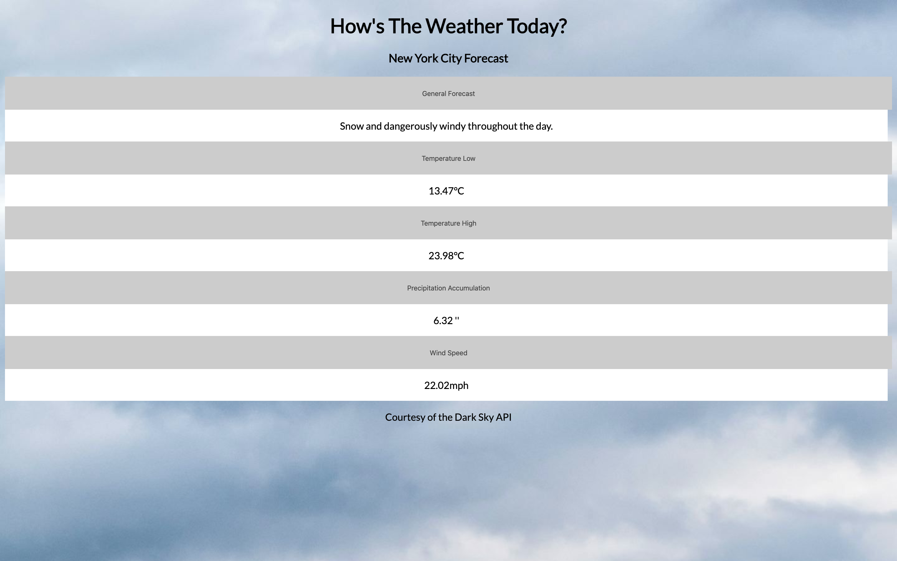

# UI-API-Project

### Weather Accordion
This is a project for the General Assembly Software Engineering Immersive program meant to test your programming knowledge in specifically utilizing APIs with javascript, DOM, and responsive design with a UI type in mind. For this project, I chose the accordion UI and implemented data from the Dark Sky Forecast API that tracks the day to day forecast in a specific location. For this one, I ended up going with New York City since it was the default location the API displayed.

### Languages Used
* HTML
* CSS
* Javascript

### UI Design 

### Future Goals
* Make it more responsive with backgrounds changing depending on the forecast
* More mobile-friendly
* More visually appealing

### Notes
* The data for real-time is off for some reason, so I'll have to investigate a little more thoroughly into why the weather data is incorrect, whether it be the API or on my end. 

### Build Status

